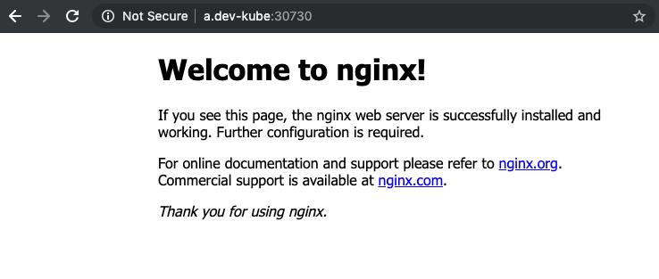

# Installation 

Kubernetes: 1.15.3
Containerd: 1.2.4

Follow these instructions to locally set up a 3 node kubernetes cluster with 1
dedicated master containing a single Etcd. All nodes will be running calico and containerd.

## Pre-requisites

In order to follow these instruction you need to install
- [Vagrant](https://www.vagrantup.com/)
- [kubectl](https://kubernetes.io/docs/tasks/tools/install-kubectl/)

These instructions have been tested to work with version vagrant `2.2.4` on OS X Mojave.

## Create a 'local' kubernetes cluster running Calico & Containerd

If at any point you want to reset things, destroy all VMs by running:

```bash
vagrant destroy --force
```

1. Clone this repo

2. If you want to bring up a 3 node cluster with 1 dedicated master using one command, run this at the repo root

```bash
vagrant up
```

Alternatively, you can also bring up each node separately: you <b>must</b> start with the master node:

```bash
vagrant up k8s-master
```

Once this has been provisioned you can either first connect to the cluster (see 3.), or directly proceed to provision
the other nodes:

```text
vagrant up k8s-node-{i}, i=1,2,3 (order doesn't matter here)
```

3. The kube config for your new cluster was copied for you to `.kube/config` - tell
`kubectl` to use it by running

```bash
export KUBECONFIG=$(PWD)/.kube/config
```

4. Check that everything so far is working by running

```bash
kubectl get nodes -owide
```

You should see (with potentially different `VERSION`, `OS-Image`, `KERNEL-VERSION`, `CONTAINER-RUNTIME`):

```bash
NAME         STATUS   ROLES    AGE   VERSION   INTERNAL-IP      EXTERNAL-IP   OS-IMAGE                KERNEL-VERSION              CONTAINER-RUNTIME
k8s-master   Ready    master   47m   v1.14.1   192.168.205.10   <none>        CentOS Linux 7 (Core)   3.10.0-957.5.1.el7.x86_64   containerd://1.2.4
k8s-node-1   Ready    <none>   43m   v1.14.1   192.168.205.11   <none>        CentOS Linux 7 (Core)   3.10.0-957.5.1.el7.x86_64   containerd://1.2.4
k8s-node-2   Ready    <none>   39m   v1.14.1   192.168.205.12   <none>        CentOS Linux 7 (Core)   3.10.0-957.5.1.el7.x86_64   containerd://1.2.4
k8s-node-3   Ready    <none>   35m   v1.14.1   192.168.205.13   <none>        CentOS Linux 7 (Core)   3.10.0-957.5.1.el7.x86_64   containerd://1.2.4
```

You might have to wait for a minute or so until all nodes are have `STATUS: Ready` - if this is *not* what you see take a look at the logs in 2. to figure out what went wrong.

At this point you've got a functioning kubernetes cluster. Read on to see how to connect to an nginx webserver via node port and local DNS.

## Connect via NodePort

Run (if not done already)

```bash
export KUBECONFIG=$(PWD)/.kube/config
```

to connect to your local kubernetes cluster you installed in the previous section. Then execute the following to create an nginx pod in context namespace (likely 'default'):

```bash
kubectl run nginx-server --image nginx --port=80
```

Next, run

```bash
kubectl expose deployment nginx-server --type=NodePort
```

to expose this server via node port. Once completed, we can find the node port
by running (requires [jq](https://stedolan.github.io/jq/) to be installed)

```bash
kubectl get svc -ojson | jq '.items[] | select(.metadata.name == "nginx-server")'.spec.ports[].nodePort
```

Alternatively,

```bash
kubectl get svc nginx-server
```

and manually parse the node port value.

In this example assume that the node port for the nginx-server service was set to `30730`: use any of the node 'INTERNAL-IP' values, e.g. let's take `192.168.205.10`, and you should be able to curl `192.168.205.10:30730` or open it in a browser.

## Local DNS setup

While it might be enough to connect via IP & node port let's take a look at
setting up a local DNS server using [dnsmasq](http://thekelleys.org.uk/dnsmasq/doc.html).

On OS X the installation of `dnsmasq` is straightforward:

```bash
brew install dnsmasq
```

Then run the `dnsmasq` service by doing

```bash
sudo brew services start dnsmasq
```

(note the `sudo`!)

Edit `/usr/local/etc/dnsmasq.conf` and add

```text
address=/local-dev/192.168.205.10
```

Here, `local-dev` will be the domain we want to route to `192.168.205.10` (the master node IP address - but any of the other node IPs would work as well). Pick any
domain name you like but make sure to keep things consistent in what follows. Also, don't use any actual *real* domains because e.g. Chrome might insist that all connections use HTTPS.

Restart the `dnsmasq` service (using `sudo` again!):

```bash
sudo brew services restart dnsmasq
```

Check this works by running

```bash
dig test.local-dev @localhost
```

You should be seeing

```bash
...
;; ANSWER SECTION:
test.local-dev.		0	IN	A	192.168.205.10
...
```

Next we need to tell OS X about `local-dev`. Create the `/etc/resolver` directory by running

```bash
sudo mkdir /etc/resolver
```

Then execute

```text
sudo tee /etc/resolver/local-dev >/dev/null <<EOF
nameserver 127.0.0.1
EOF
```

Finally either open a web browser (or use `curl`) at

```text
http://mytest.local-dev:30730/
```

The `mytest.local-dev` domain is an example, in fact `a.local-dev` would work
as well.


